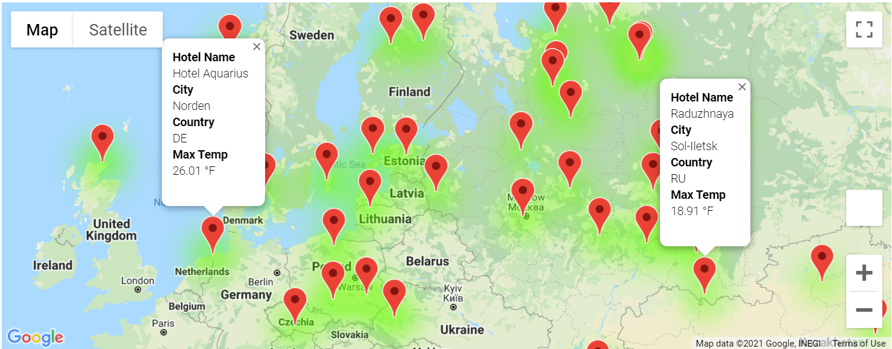
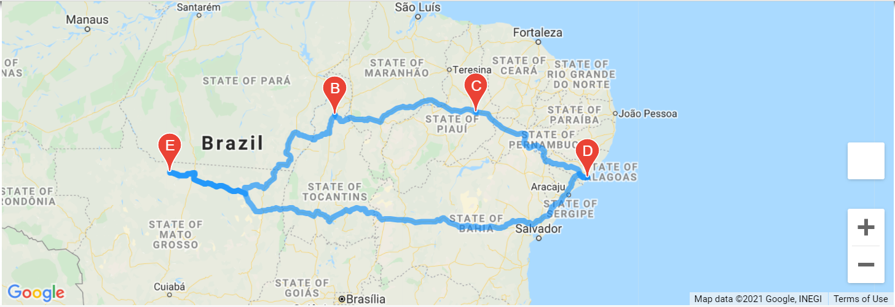

# World_Weather_Analysis
API, JSON, Python Pandas and Matplotlib
# Purpose
The project creates a google map with detailed information including hotel name, city, country, weather description shown on the map by clicking the locating pins.  
  
The itinerary for the selected five locations in Brazil is created with detailed information.  
  
# Procedure
- Input preference (preferred temperature to travel) is provided by the user.  
- Around 2000 cities around the world get generated with detailed weather information pulled from OpenWeather using API key.  
- Use Python to process the JSON data pulled from the website and filter out the cities that satisfy the weather conditions provided by the user.  
- From the selected cities, detailed coordinates are collected and input to Google Maps Platform for map generation.  
- Based on the local weather condition, heatmap gets generated.  
- Implement Google Nearby Service with Google API key to search hotel information for each selected city.  
- Indicate the location of the hotels with detailed information including name, city, country and weather description (HTML Texting) on the map generated.  
- Implement Google Direction API service to generate itinerary for any selected destinations and waypoints.  
